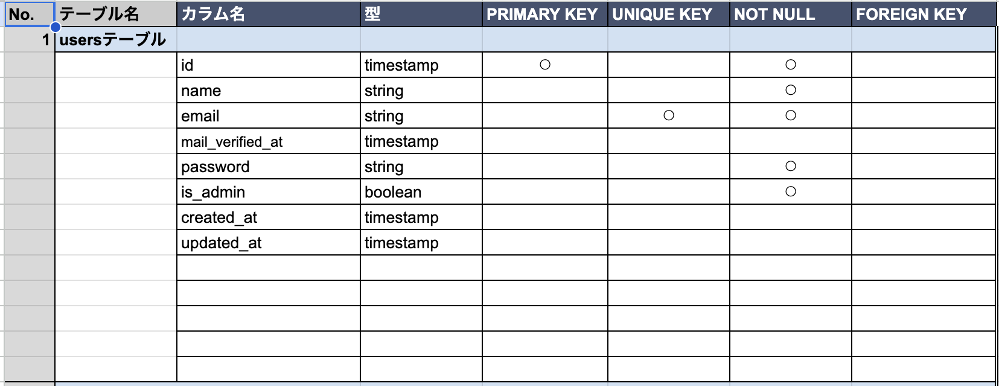
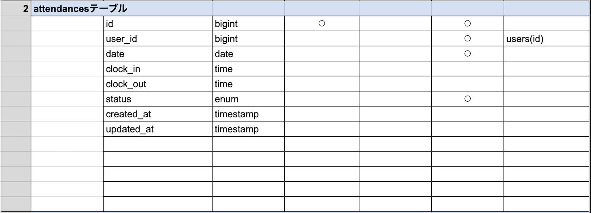
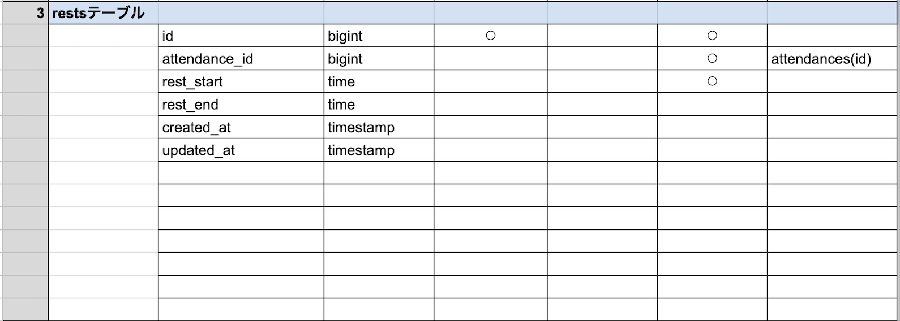
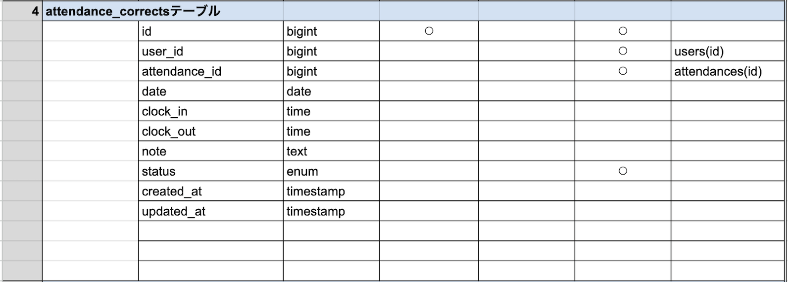
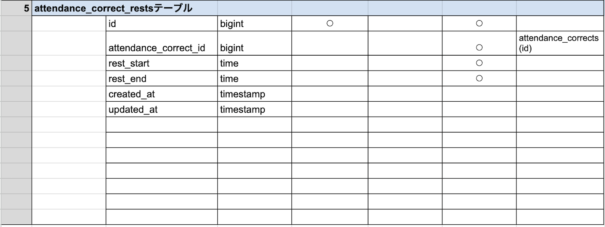
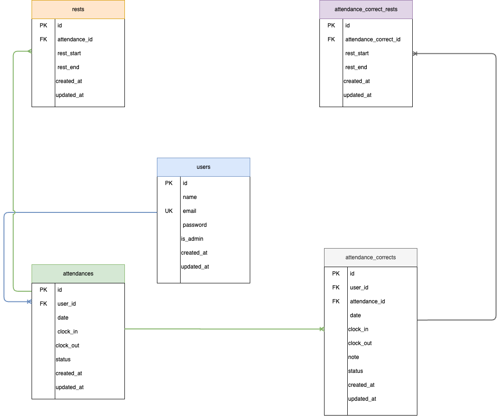

# Attendance
## 機能

### 一般ユーザー

- 勤怠打刻 (出勤・退勤)
- 勤怠一覧の確認
- 勤怠詳細の確認
- 勤怠修正申請の提出
- 自分の修正申請の確認

### 管理者ユーザー

- 日次勤怠一覧の確認
- 各勤怠の詳細確認・修正
- スタッフ一覧の確認
- スタッフ毎の月次勤怠一覧の確認
- 修正申請一覧の確認
- 修正申請の詳細確認・承認

## セットアップ

### 前提条件

- PHP 7.4以上
- Composer
- MySQL

### インストール

1. リポジトリをクローンします。

    ```sh
    git clone

    ```

2. 依存関係をインストールします。

    ```sh
    composer install
    ```

3. 環境設定ファイルをコピーして編集します。

    ```sh
    cp .env.example .env
    ```

    `.env`ファイルを編集して、データベース接続情報などを設定します。

4. アプリケーションキーを生成します。

    ```sh
    php artisan key:generate
    ```

5. データベースをマイグレーションしてシーディングします。

    ```sh
    php artisan migrate:fresh --seed
    ```

6. ローカル開発サーバーを起動します。

    ```sh
    php artisan serve
    ```

    ブラウザで `http://localhost` にアクセスしてアプリケーションを確認します。

## テーブル仕様書






## ER図


## テストユーザー

### 一般ユーザー

- Email: `testuser@example.com`
- Password: `password`

### 管理者ユーザー

- Email: `admin@example.com`
- Password: `password`

## ライセンス

このプロジェクトはMITライセンスの下で公開されています。詳細はLICENSEファイルを参照してください。
